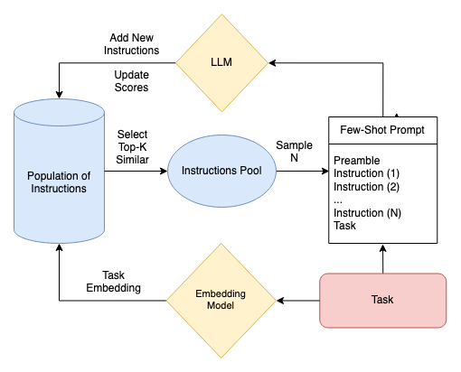

# Evolutionary Prompt Selection

## Automated prompt generation for the Planner/Worker/Solver (PWS) framework via evolutionary selection.
This repository implements an evolutionary selection algorithm in order to find the most instructive examples for solving novel tasks with Augmented Language Models (ALMs).

### How to use?
* First, install the requirements: `pip3 install -r requirements.txt`
* Then, get your pinecone creditentials (api-key and pinecone env) and store them in `secrets.json`
* Now set up a database with the seed instructions: `python3 scripts/db_setup.py`

That is all, your system is set up. 

Now you can run `python3 scripts/run.py` to play with the model and the prompter.

This script by defaults loads a `StableBeluga-13B` model and initializes a PWS agent with Wikipedia access, along with an embedding model and an evolutionary prompter.
The user is then asked to provide a question.
Prompter selects 3 examples based on the question and the agent tries to answer the question based on these 3 examples.

### Accelerated Training
`scripts/accelerated_training.py` script can be used to train the prompter on multiple GPUs via HuggingFace Accelerate library.
In order to do this, you will need to first configure the accelerate environment.
This can be done either by running `accelerate config` and answering the provided questions 
or by runnig the following command for the defulat configuration:

`python -c "from accelerate.utils import write_basic_config; write_basic_config(mixed_precision='fp16')"`

after your environment is configured, you can start training with the following command:

`accelerate launch --num_processes=8 scripts/accelerated_training.py`

where `--num_processess` denotes the number of GPUs to utilize.

The script by default trains the prompter on `trivia_qa` dataset using a `StableBeluga-13B` model.

### Accelerated Testing
`scripts/accelerated_testing.py` script can be used to test the prompter on multiple GPUs via HuggingFace Accelerate library.
Assuming that you have configured your accelerate environment as previously mentioned, you can run tests with the following command:

`accelerate launch --num_processes=8 scripts/accelerated_testing.py --test-config test_configs/sampling_tests.json`

where `--num_processess` denotes the number of GPUs to utilize and `--test-config` denotes the test configuration file.

### What else?
You can find my Master's Thesis on Evolutionary Prompt Selection in `eps.pdf`.
You can find implementation details of the LLM interface and the evolutionary prompter in `src/utils.py`.
For more examples, you can check the attached notebooks.

### PWS Framework
The repository also includes an adapted implementation of the PWS framework that works with a single LLM instance.
* `src/nodes.py` implements the agents as well as the unifying control flow.
* Prompts for the individual agents are contined within `src/prompts.json`.
